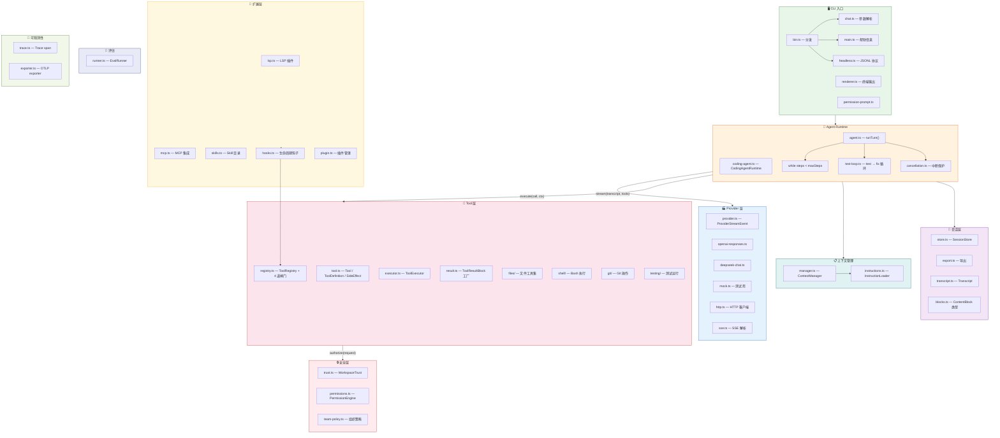
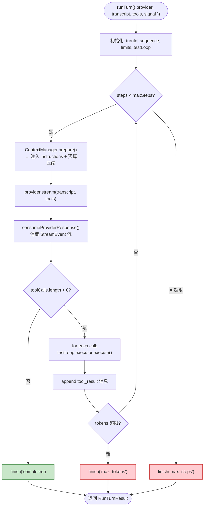
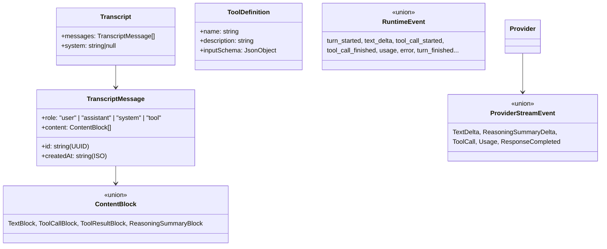
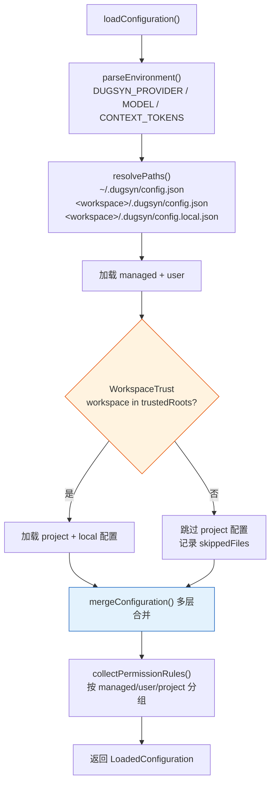

# dugsyn 架构总览

> dugsyn（独孤信多面体煤精组印 CLI）是一个 tutorial-built 的 coding agent CLI，吸收了各大厂 agent 工具和教程的精髓，自研融合。
> 以下 Mermaid 图展示 dugsyn 完整架构。可在 VS Code（安装 Markdown Preview Mermaid 插件）或 GitHub 上直接渲染。

---

## 1. 整体架构总览



---

## 2. Agent 循环 — runTurn()



核心设计：
- **同步 `runTurn()`** — 每次调用是一个完整的 turn，内部 while 循环处理多轮 tool call
- **test-loop 内置** — `testLoop.executor` 包装了 ToolExecutor，在执行 `execute_command` 后自动运行 `npm test`
- **中断保护** — `AbortSignal.any([callerSignal, durationTimer])`，超时或 Ctrl-C 优雅退出
- **ProviderStepError 带 partialContent** — stream 中断时保留已收集的文本和 tool_call 块，不丢失已完成的工作

---

## 3. 数据类型层级



Key:
- `Transcript` 是 immutable 的 — 每次 append 返回新对象
- `ProviderStreamEvent` 是 Provider 向外暴露的流事件
- `RuntimeEvent` 是 Agent 向外 emit 的高级事件（含 protocolVersion, sequence, timestamp）

---

## 4. 配置体系 — 4 层合并



合并优先级（后层覆盖前层）：
1. managed — 组织级策略（可设 teamPolicy）
2. user — `~/.dugsyn/config.json`
3. project — `<workspace>/.dugsyn/config.json`
4. local — `<workspace>/.dugsyn/config.local.json`
5. environment — `DUGSYN_*` 环境变量（最高优先级）

---

## 5. 模块导图

```
dugsyn/src/
├── cli/                   # CLI 入口（bin, chat, main, headless, renderer, session）
├── config/                # 配置加载（loader.ts, schema.ts）
├── context/               # 上下文管理（manager.ts, instructions.ts）
├── evals/                 # 评估运行器
├── extensions/            # 扩展（hooks, lsp, mcp, plugin, skills）
├── hosts/                 # 宿主适配（IDE 集成协议）
├── messages/              # 数据类型（blocks, schemas, transcript）
├── observability/         # 可观测性（trace, exporter）
├── protocol/              # 序列化（json, serde）
├── providers/             # Provider 实现（openai, deepseek, mock, http, sse）
├── runtime/               # Agent 运行时（agent, coding-agent, cancellation, events, test-loop）
├── security/              # 安全（permissions, trust, team-policy）
├── sessions/              # 会话持久化（store, export）
├── subagents/             # 子代理（coordinator, capabilities）
├── tools/                 # 工具系统（file, git, shell, testing, registry, executor）
└── version.ts
```
