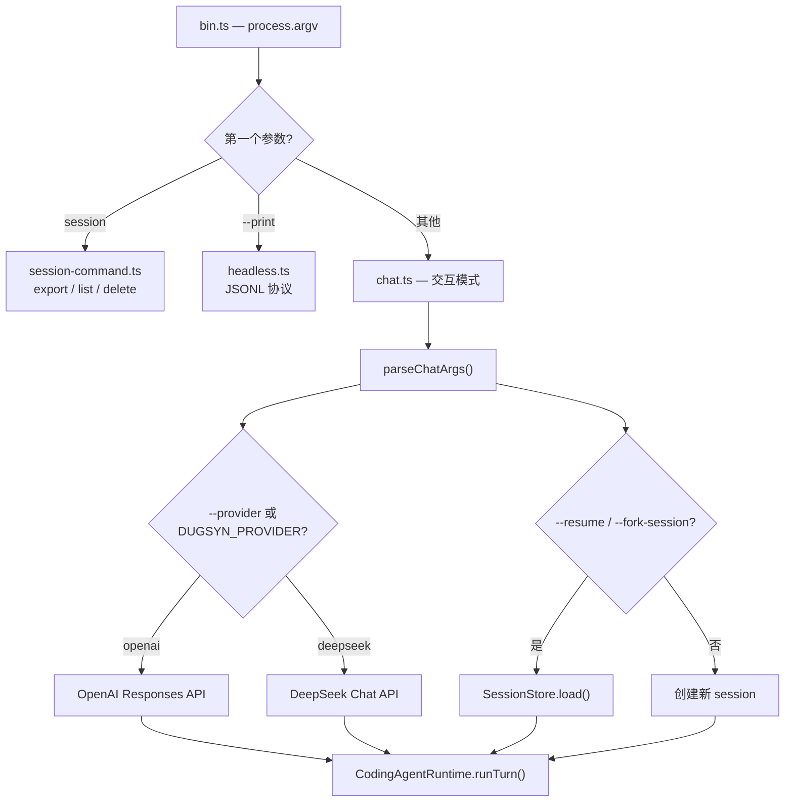
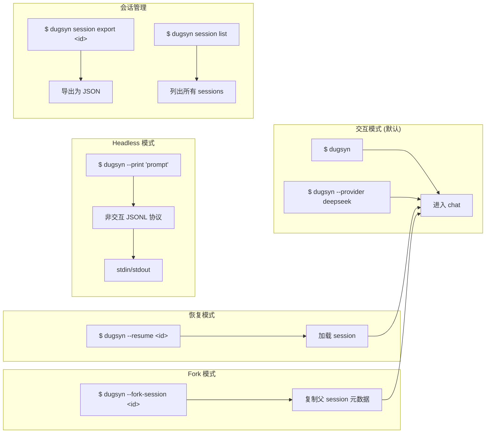

# 第 1 章：CLI 入口与参数解析

> dugsyn CLI 的入口层负责参数解析、模式分发、Provider 选择和环境变量绑定。它不执行 Agent 逻辑，只负责解析 → 校验 → 调用。

---

## 1. 入口分发



---

## 2. 参数解析 — parseChatArgs()

| 参数 | 来源 | 说明 |
|------|------|------|
| `--provider` | CLI / `DUGSYN_PROVIDER` | `openai` 或 `deepseek` |
| `--model` | CLI / `DUGSYN_MODEL` / defaults | Provider 的模型名 |
| `--workspace` | CLI | 工作目录，默认 cwd |
| `--session-dir` | CLI / `DUGSYN_SESSION_DIR` / defaults | 会话持久化目录 |
| `--resume` | CLI | 恢复指定 session ID |
| `--fork-session` | CLI | 从已有 session fork |
| `--session-name` | CLI | 新/fork session 的名称 |

API Key 从环境变量读取（`OPENAI_API_KEY` / `DEEPSEEK_API_KEY`），不加载 `.env.local`。

---

## 3. 模式



---

## 4. 环境变量一览

| 变量 | 作用 | 层级 |
|------|------|------|
| `DUGSYN_PROVIDER` | Provider 选择 (`openai`/`deepseek`) | 最高 |
| `DUGSYN_MODEL` | 模型名 | 最高 |
| `DUGSYN_CONTEXT_TOKENS` | 上下文 token 预算 | 最高 |
| `DUGSYN_SESSION_DIR` | 会话存储目录 | CLI > env > default |
| `DUGSYN_MANAGED_CONFIG` | 组织级配置文件路径 | 仅 env |
| `DUGSYN_USER_CONFIG` | 用户配置文件路径 | env > default |
| `OPENAI_API_KEY` | OpenAI API key | 仅 env |
| `DEEPSEEK_API_KEY` | DeepSeek API key | 仅 env |

---

## 5. 帮助信息

```
dugsyn 0.1.0

Usage:
  dugsyn [options]
  dugsyn chat [--provider <openai|deepseek>] [--model <model>] [--workspace <path>]
  dugsyn --print [prompt] [--input-format <text|jsonl>] [--output-format <text|json|jsonl>]
  dugsyn --resume <session-id> [--session-dir <path>]
  dugsyn --fork-session <session-id> [chat options]
  dugsyn session export <session-id> [--session-dir <path>]

Configuration:
  ~/.dugsyn/config.json and trusted <workspace>/.dugsyn/config*.json
  CLI > DUGSYN_* > local > project > user > managed > defaults
```

---

## 6. 文件清单

| 文件 | 说明 |
|------|------|
| `dugsyn/src/cli/bin.ts` | CLI 入口，进程启动点 |
| `dugsyn/src/cli/main.ts` | 帮助信息 + Node 版本检查 |
| `dugsyn/src/cli/chat.ts` | 参数解析、Provider 创建、session 管理 |
| `dugsyn/src/cli/session.ts` | 会话工厂 (create / resume / fork) |
| `dugsyn/src/cli/headless.ts` | 非交互 JSONL 协议实现 |
| `dugsyn/src/cli/renderer.ts` | 终端输出格式化和渲染 |
| `dugsyn/src/cli/permission-prompt.ts` | 交互式权限提示 |
| `dugsyn/src/cli/errors.ts` | CLI 错误类型 |
| `dugsyn/src/cli/input.ts` | 用户输入处理 |
| `dugsyn/src/version.ts` | 版本号常量 |
