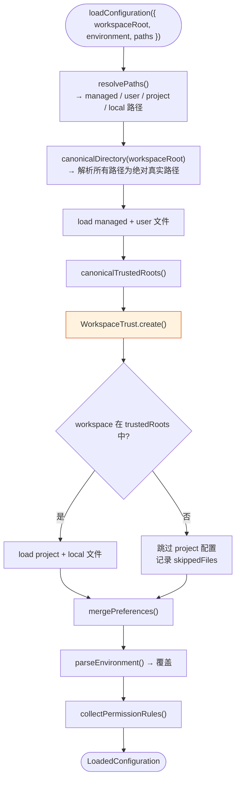
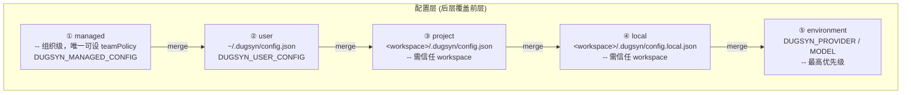
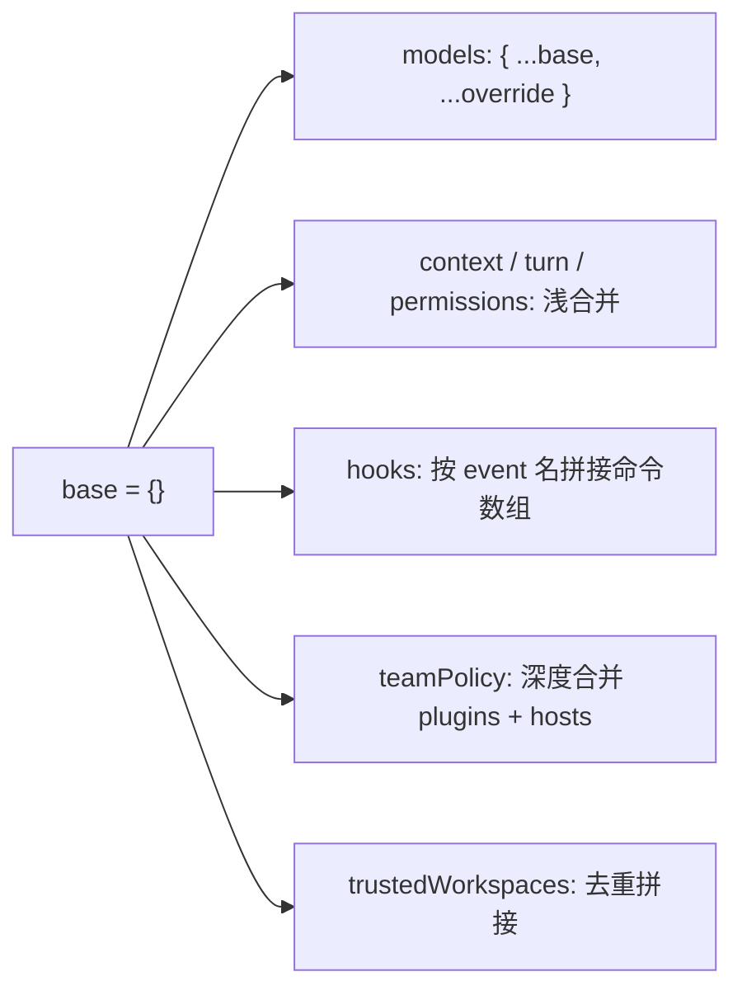
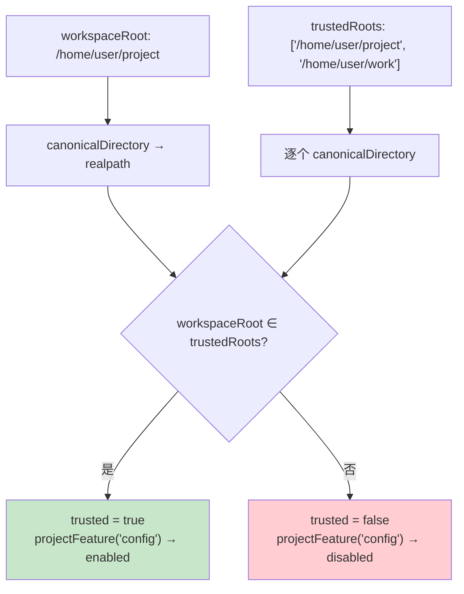

# 第 2 章：配置体系

> dugsyn 的配置系统支持 4 层合并、Zod schema 校验、信任检查、环境变量覆盖和深度合并嵌套对象。

---

## 1. 配置加载流程



---

## 2. 四层配置



每层的 schema 通过 Zod 校验。不合法的配置直接抛 `ConfigurationError`，不会静默忽略。

---

## 3. 合并策略



关键：**`trustedWorkspaces` 只在 managed 和 user 层设置**，project/local 层不允许声明（避免工作区自授权）。

---

## 4. 信任模型



`WorkspaceTrust` 使用 realpath，所以 symlink 别名无法绕过信任检查。

---

## 5. Schema 结构（关键字段）

```typescript
// configurationSchema (Zod)
{
  provider: z.enum(["openai", "deepseek"]).optional(),
  models: z.object({ openai: z.string().optional(), deepseek: z.string().optional() }).optional(),
  sessionDirectory: z.string().optional(),
  trustedWorkspaces: z.array(z.string()).optional(),
  context: z.object({ maxTokens: z.number().positive().optional() }).optional(),
  instructions: z.object({ userPath: z.string().optional() }).optional(),
  turn: z.object({ maxSteps: ..., maxDurationMs: ..., maxInputTokens: ..., maxOutputTokens: ... }).optional(),
  permissions: z.object({ defaultDecision: ..., rules: z.array(PermissionRule) }).optional(),
  mcpServers: z.record(z.string(), z.object({ command: ..., args: ... })).optional(),
  lspServers: z.record(z.string(), z.object({ command: ... })).optional(),
  hooks: z.record(z.enum(["PreToolUse", "PostToolUse", ...]), z.array(z.string())).optional(),
  skills: z.object({ userDirectory: ... }).optional(),
  teamPolicy: z.object({ plugins: ..., hosts: ..., audit: ... }).optional(),
}
```

---

## 6. 安全检查

| 检查 | 说明 |
|------|------|
| 路径规范 | `resolvePaths` 确保所有路径在 workspace 内 |
| JSON 解析 | `JSON.parse` 失败 → `ConfigurationError` |
| Schema 校验 | Zod `safeParse` 失败 → 详细路径错误 |
| 层限制 | project/local 禁止设 `teamPolicy` / `trustedWorkspaces` |
| Symlink 保护 | `realpath` 解析 + `isWithin` 检查 |

---

## 7. 文件清单

| 文件 | 说明 |
|------|------|
| `dugsyn/src/config/schema.ts` | Zod schema 定义 + 类型导出 |
| `dugsyn/src/config/loader.ts` | 核心加载、合并、校验逻辑 |
| `dugsyn/src/security/trust.ts` | WorkspaceTrust 信任检查 |
| `dugsyn/src/security/team-policy.ts` | 组织策略强制执行 |

---

## 8. 还不做什么

- 不热加载配置文件（运行时修改不生效）
- 不提供 `dugsyn config` 管理命令
- 不存在 encrypted / secrets 配置机制
