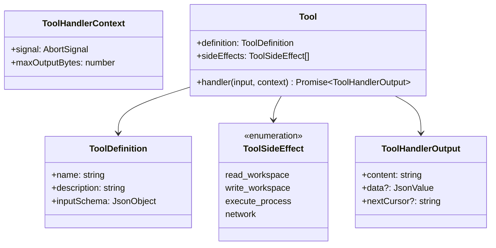
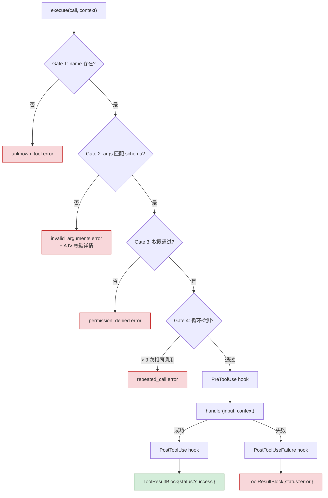
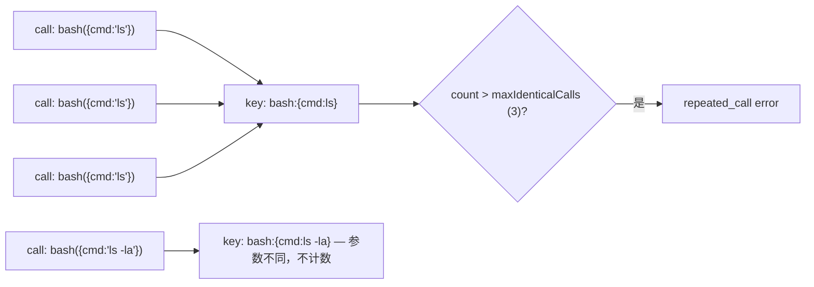
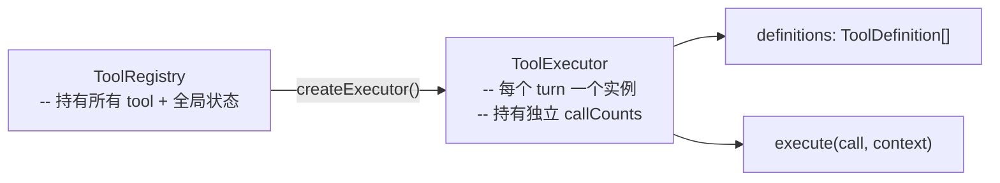

# 第 3 章：工具系统

> dugsyn 的工具系统采用 4 道闸门的注册-分发模型，集成权限检查、循环检测和 Hook 生命周期。

---

## 1. 工具契约 — 3 个组成部分

关键设计：
- **`handler` 是 async** — 支持异步操作（文件 IO、shell、网络）
- **`nextCursor` 分页** — 长输出可分段返回，tool handler 自定 cursor 格式
- **`sideEffects` 四分类** — 权限系统据此决定是否需要批准

---

## 2. ToolRegistry — 4 道闸门

所有闸门返回结构化 `ToolResultBlock`（非抛异常），模型读到错误信息后自行纠正。

---

## 3. 循环检测

使用 `canonicalJson()` 排序 key → 语义相同但顺序不同的 JSON 视为同一调用。

---

## 4. ToolExecutor vs ToolRegistry

**Registry 是单例，Executor 是 turn-local**。这样每个 turn 的循环检测计数独立，上一个 turn 的重复调用不影响当前 turn。

---

## 5. 工具结果工厂

| 函数 | 说明 |
|------|------|
| `createToolSuccessResult(id, output)` | 截断 content 到 `maxOutputBytes` |
| `createToolErrorResult(id, status, message)` | 结构化错误：`unknown_tool` / `invalid_arguments` / `permission_denied` / `repeated_call` / `execution_failed` |

`ToolHandlerOutput` 返回 `{ content, data?, nextCursor? }`。`data` 是任意 JSON value，用于传递机器可读的结构化数据给 model。

---

## 6. 文件清单

| 文件 | 说明 |
|------|------|
| `dugsyn/src/tools/tool.ts` | Tool / ToolDefinition / ToolSideEffect 类型定义 |
| `dugsyn/src/tools/registry.ts` | ToolRegistry — 注册、4 道闸门 dispatch、Hook 集成 |
| `dugsyn/src/tools/executor.ts` | ToolExecutor 接口 — turn-local 执行器 |
| `dugsyn/src/tools/result.ts` | ToolResultBlock 工厂函数 + 截断逻辑 |
ENDDOFDOC
echo "Written ch03-tool-system.md"