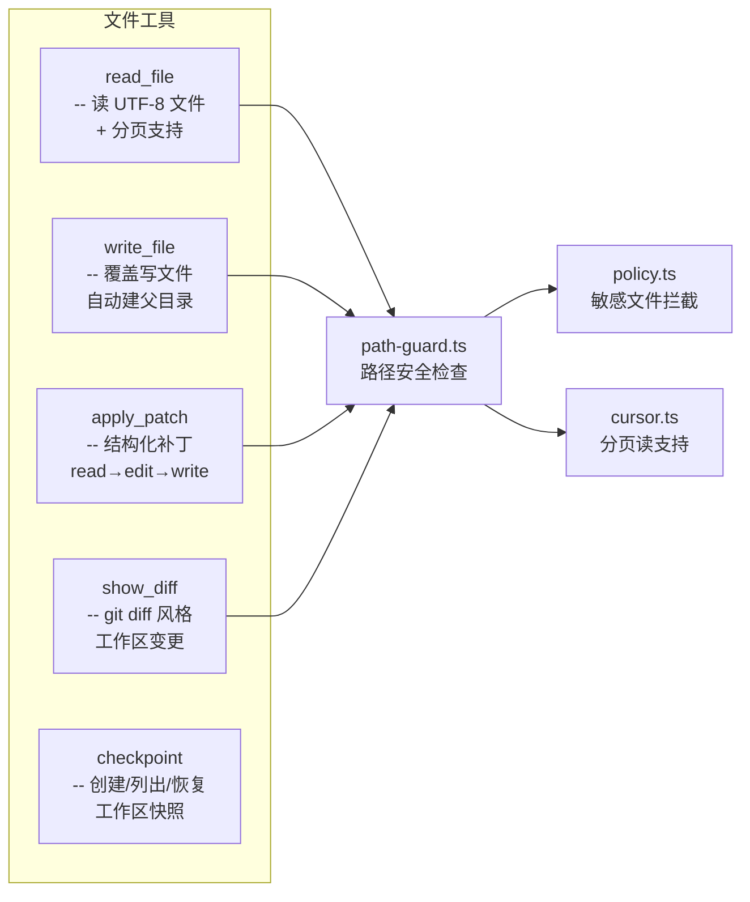
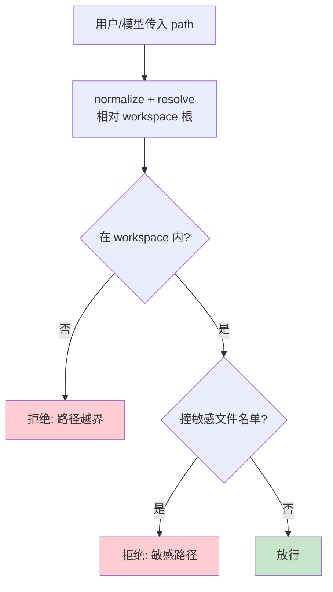
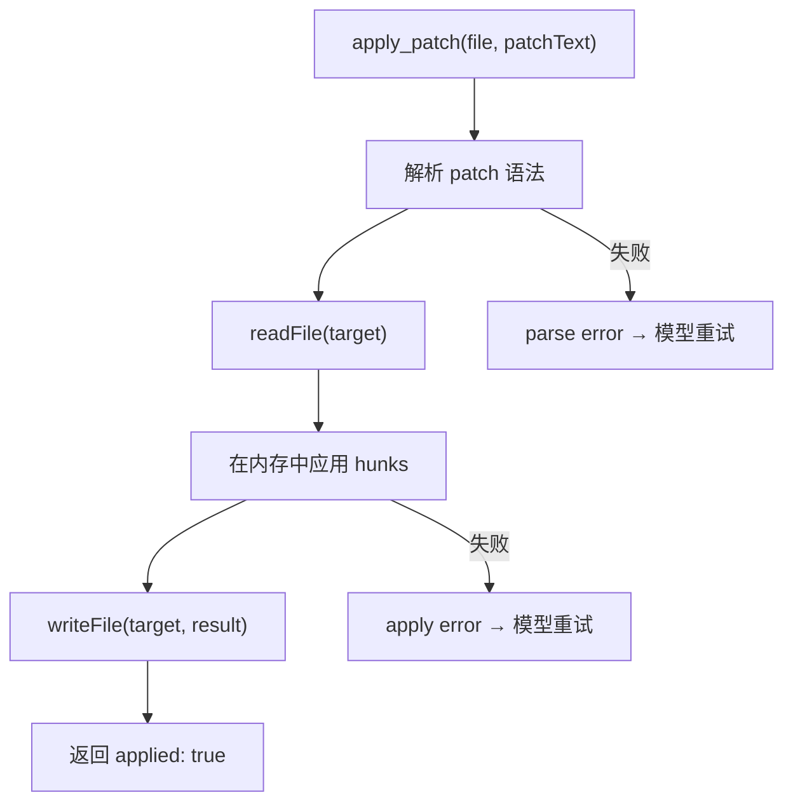
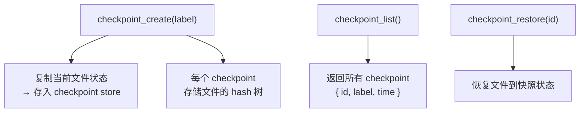
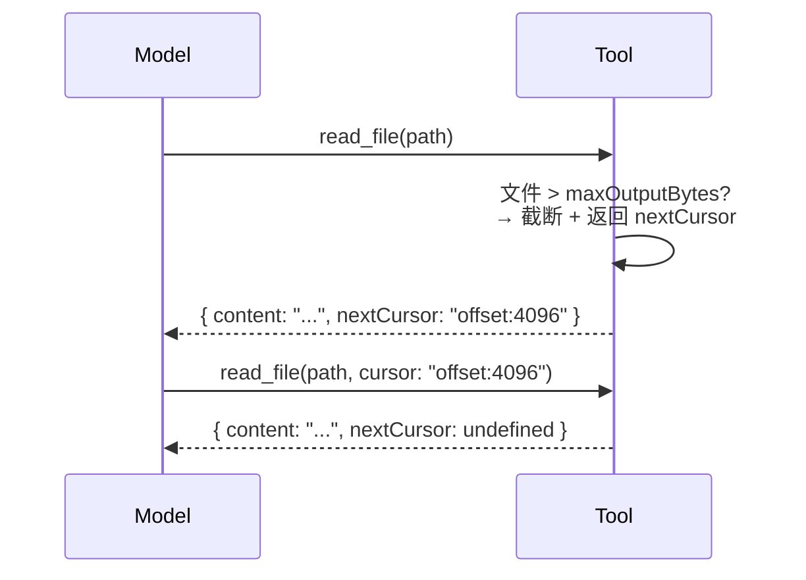

# 第 4 章：文件工具集

> dugsyn 的文件操作不直接用 `readFile` / `writeFile`，而是通过安全检查层 — 路径守卫、敏感文件拦截、分页输出、结构化 diff 和 checkpoint 回滚。

---

## 1. 工具一览

---

## 2. 路径守卫 (path-guard)

敏感路径包括：`.git/`, `.env`, `.env.local`, `credentials`, 所有以 `.` 开头的密钥类文件。

---

## 3. apply_patch — 结构化编辑

不直接让模型写整个文件 — `apply_patch` 是一种更安全、更精确的编辑方式。

---

## 4. checkpoint — 工作区快照

checkpoint 不依赖 git — 直接在文件系统做快照，适用于 undo 操作。

---

## 5. diff — 工作区变更

返回 git diff 风格的输出，让模型了解当前工作区的修改状态。

---

## 6. 文件分页 (cursor)

大文件自动分页，cursor 是 tool handler 内部的 offset 编码。

---

## 7. 文件清单

| 文件 | 说明 |
|------|------|
| `dugsyn/src/tools/files/index.ts` | 文件工具统一导出 |
| `dugsyn/src/tools/files/text.ts` | read_file / write_file 实现 |
| `dugsyn/src/tools/files/patch.ts` | apply_patch 结构化编辑 |
| `dugsyn/src/tools/files/diff.ts` | show_diff 工作区变更 |
| `dugsyn/src/tools/files/checkpoint.ts` | 工作区快照创建/恢复 |
| `dugsyn/src/tools/files/cursor.ts` | 分页读取逻辑 |
| `dugsyn/src/tools/files/path-guard.ts` | 路径安全守卫 |
| `dugsyn/src/tools/files/policy.ts` | 敏感文件拦截规则 |
