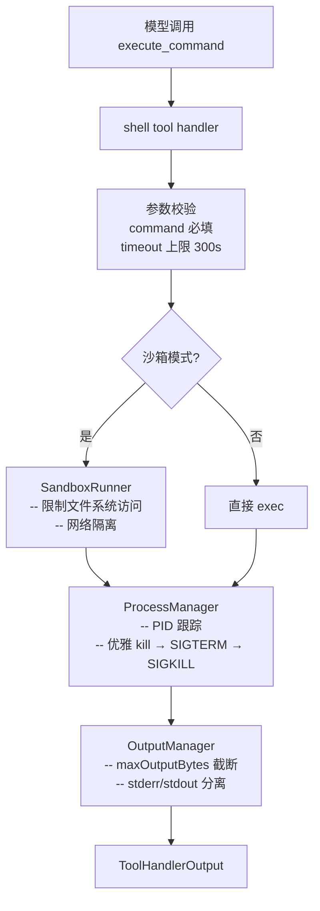
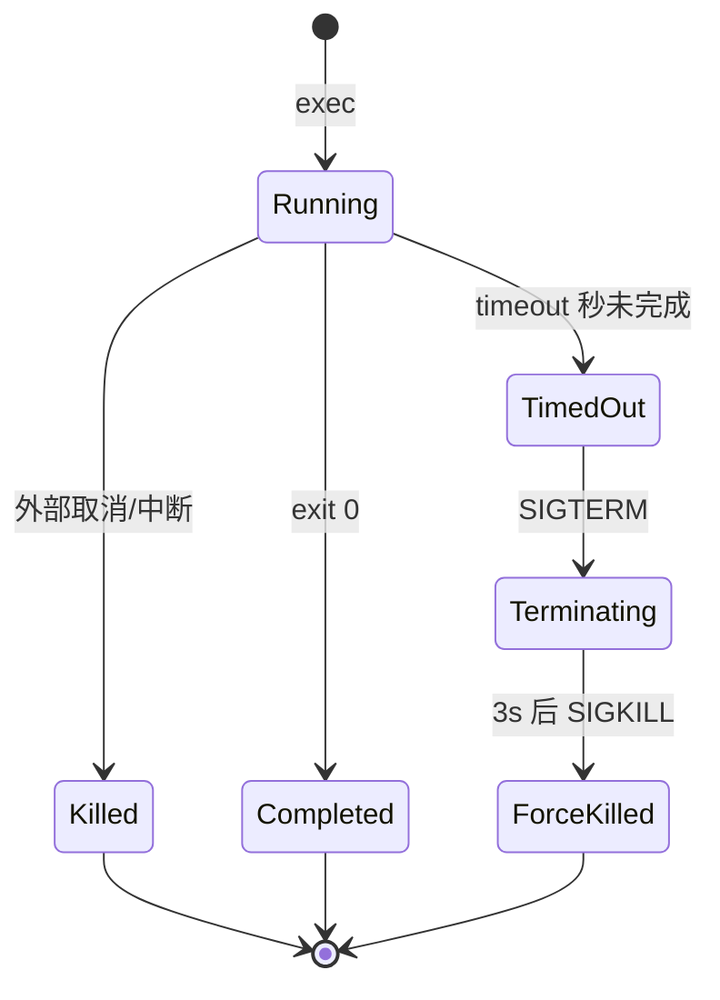
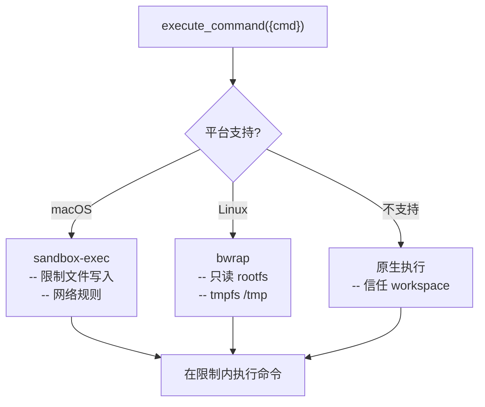
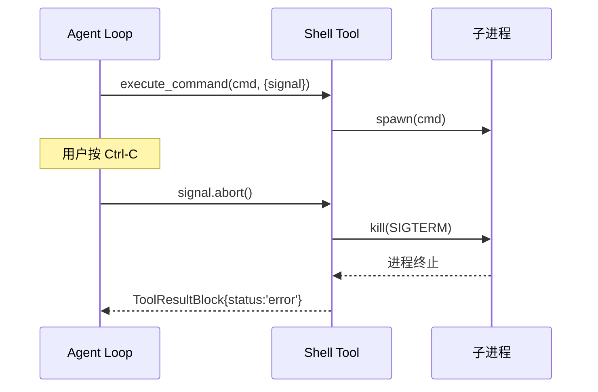

# 第 5 章：Shell 执行与沙箱

> dugsyn 的 shell 工具支持执行任意命令、超时控制、输出截断、进程生命周期管理和跨平台沙箱隔离。

---

## 1. 执行架构

---

## 2. ProcessManager — 进程生命周期

- 每个进程通过 PID 跟踪
- timeout → `SIGTERM`，3 秒后 `SIGKILL`
- 工具返回时保证进程已结束或已 kill

---

## 3. 沙箱运行器 — SandboxRunner

沙箱不是强制安全边界 — 它是防御层。真正的安全由 permission engine 控制。

---

## 4. 输出管理

| 策略 | 说明 |
|------|------|
| `maxOutputBytes` | 输出截断上限（默认值来自 registry options） |
| stdout/stderr 捕获 | 两个流独立收集 |
| 截断标记 | 超出限制时追加 `[output truncated at N bytes]` |
| 超时信息 | `Command timed out after N seconds` |

---

## 5. 中断保护

---

## 6. 文件清单

| 文件 | 说明 |
|------|------|
| `dugsyn/src/tools/shell/index.ts` | Shell 工具 handler + 参数校验 |
| `dugsyn/src/tools/shell/process-manager.ts` | 进程生命周期管理 + PID 跟踪 |
| `dugsyn/src/tools/shell/sandbox-runner.ts` | 跨平台沙箱执行 |
| `dugsyn/src/tools/shell/output.ts` | 输出截取与格式化 |
