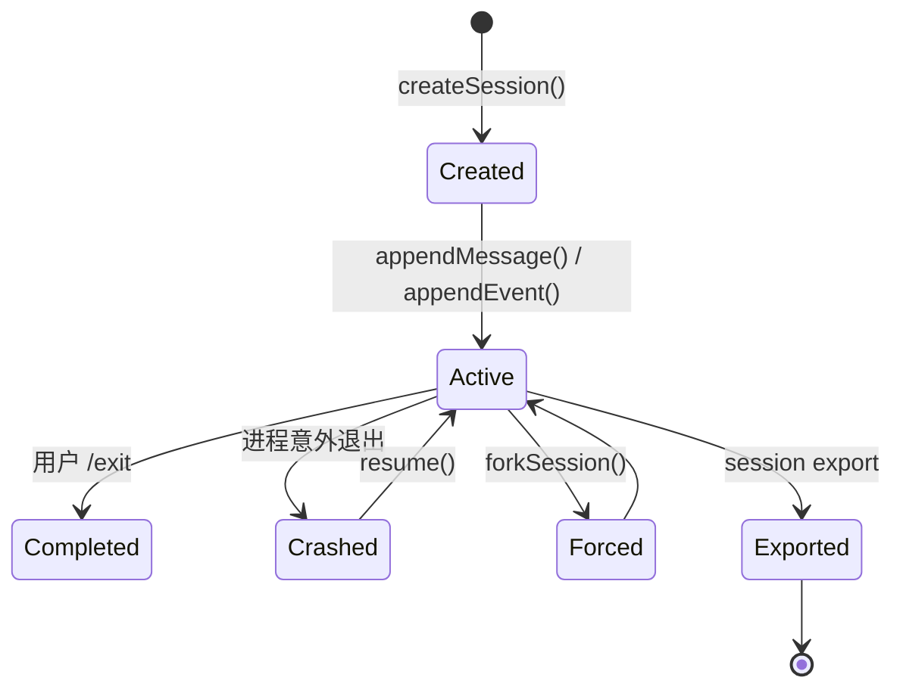
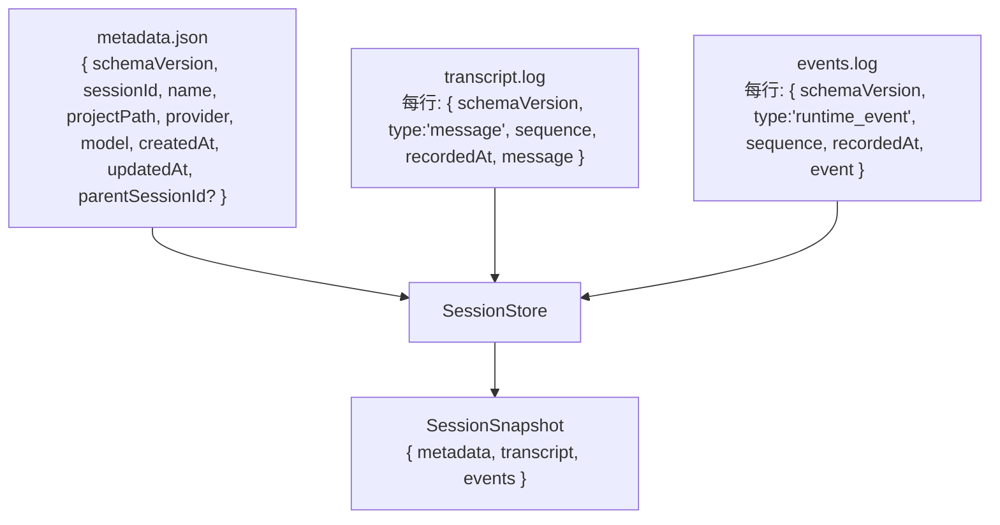
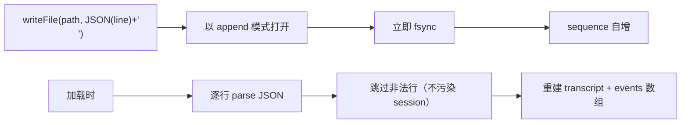
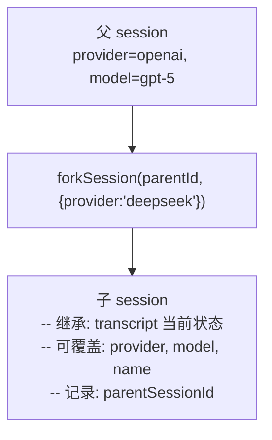
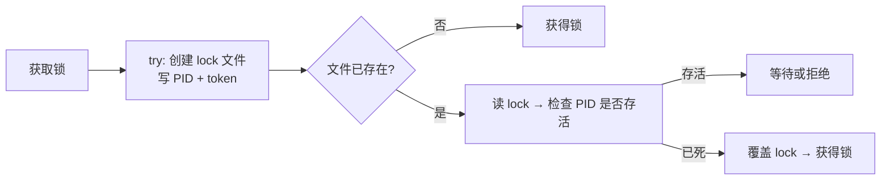
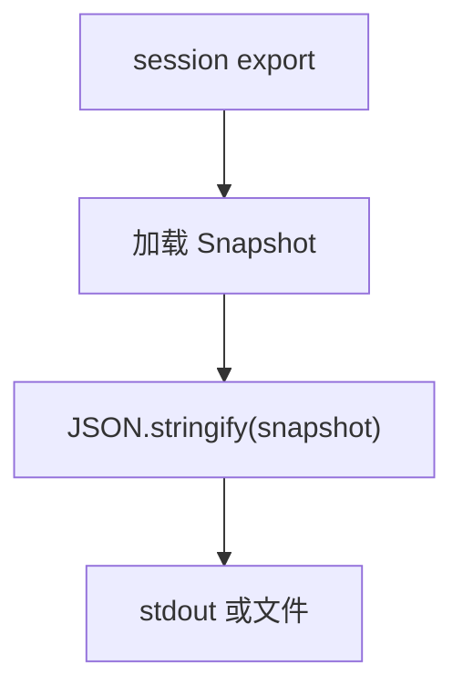

# 第 6 章：会话持久化

> dugsyn 的 session 系统支持创建、恢复、fork、导出，通过 append-only 日志 + 文件锁实现崩溃安全。

---

## 1. Session 生命周期



---

## 2. 存储结构

```
<sessionDirectory>/
  <sessionId>/
    metadata.json     # SessionMetadata (id, name, provider, model, parent...)
    transcript.log    # append-only: 每行一个 message record
    events.log        # append-only: 每行一个 runtime event record
    lock              # 进程锁文件 (含 PID + token)
```



---

## 3. Append-Only 日志



设计要点：
- **每行是独立 JSON**，不需要一次读完整个文件
- **sequence 号单调递增**，用于检测丢失
- **非法行静默跳过**，不破坏 session

---

## 4. SessionStore 操作

| 操作 | 方法 | 说明 |
|------|------|------|
| 创建 | `create(options)` | 生成 UUID sessionId + 写 metadata |
| 加载 | `load(sessionId)` | 读取 metadata + replay 日志 → Snapshot |
| 追加消息 | `appendMessage(sessionId, message)` | 写入 transcript.log |
| 追加事件 | `appendEvent(sessionId, event)` | 写入 events.log |
| 更新元数据 | `updateMetadata(sessionId, patch)` | 原子更新 metadata.json |
| Fork | `fork(parentId, options)` | 复制父 session 元数据 |
| 列出 | `list()` | 读取所有 session 目录的 metadata |
| 删除 | `delete(sessionId)` | 删除 session 目录 |

---

## 5. Fork 语义



Fork 不是复制文件 — 子 session 有自己的 transcript.log，从父的当前状态开始。

---

## 6. 进程锁



同一个 session 不能同时被两个进程打开。锁防止并发写破坏 append-only 日志。

---

## 7. 导出



导出的是完整快照 — metadata + transcript + events，可用于迁移或存档。

---

## 8. 文件清单

| 文件 | 说明 |
|------|------|
| `dugsyn/src/sessions/store.ts` | SessionStore — 创建/加载/fork/导出/锁管理 |
| `dugsyn/src/sessions/export.ts` | 会话导出逻辑 |
| `dugsyn/src/messages/transcript.ts` | Transcript 类型 + 工厂 |
| `dugsyn/src/messages/blocks.ts` | ContentBlock 联合类型 |
| `dugsyn/src/messages/schemas.ts` | Zod schema (用于日志行校验) |
| `dugsyn/src/runtime/event-schemas.ts` | RuntimeEvent Zod schema |
