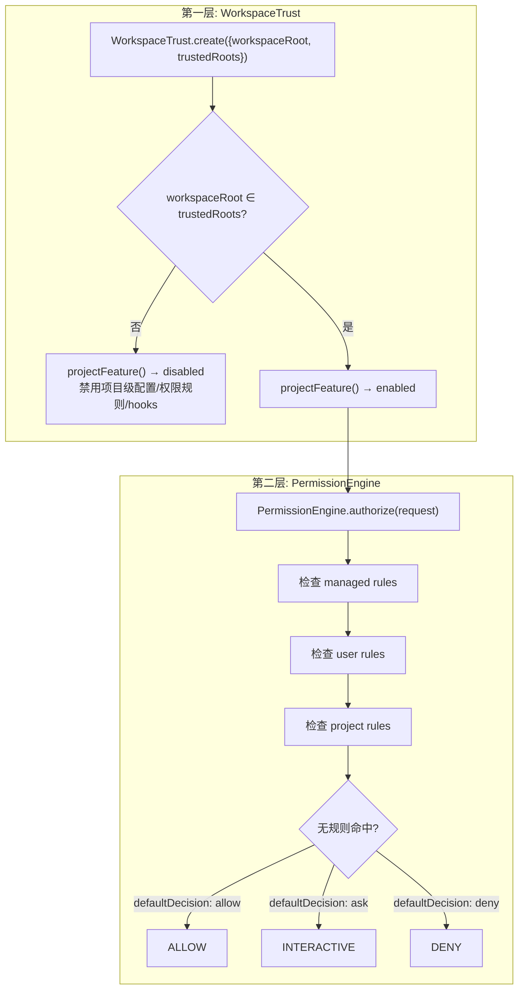
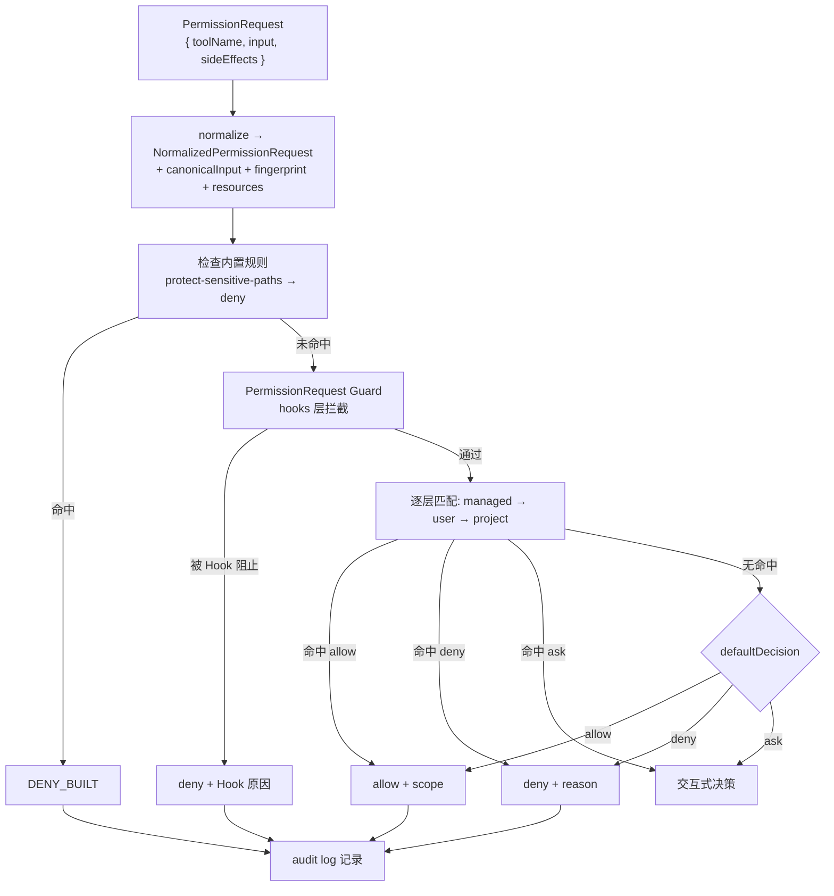
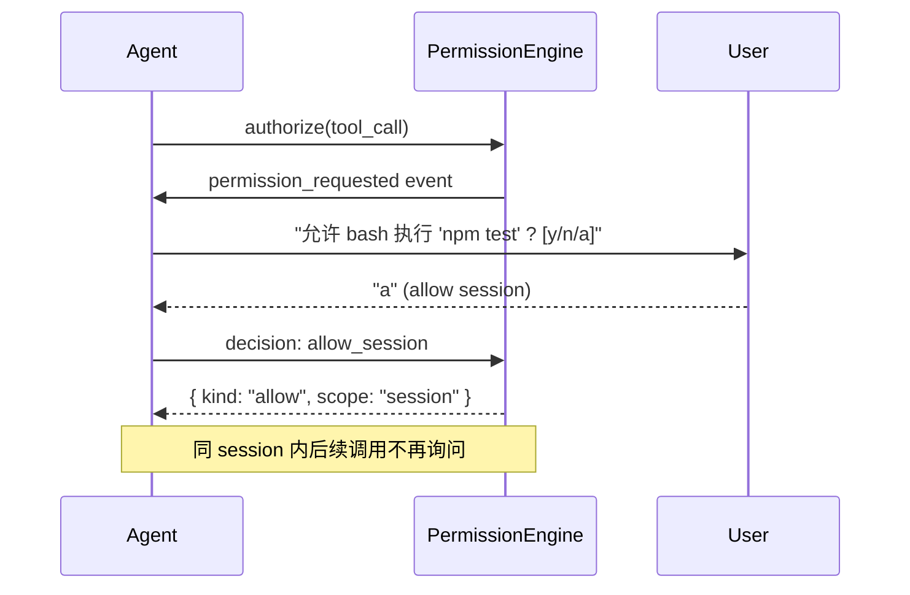
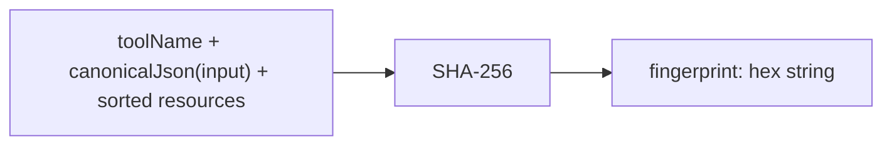

# 第 7 章：权限与信任

> dugsyn 的安全模型分为两层：WorkspaceTrust 控制「这个工作区能用吗」，PermissionEngine 控制「这个工具调用能放行吗」。

---

## 1. 双层安全架构



---

## 2. PermissionRule 结构

```typescript
interface PermissionRule {
  id: string;                    // 唯一标识
  action: "allow" | "ask" | "deny";  // 动作
  tools?: string[];              // 适用的工具名列表
  sideEffects?: ToolSideEffect[]; // 适用的副作用类型
  resources?: string[];          // 资源路径（支持 * 通配）
  reason?: string;               // 决策原因（给用户看）
}
```

规则匹配采用优先顺序：managed > user > project。同层第一条匹配即停止。

---

## 3. 权限决策流程



---

## 4. 内置保护规则

| 规则 ID | 动作 | 匹配 |
|---------|------|------|
| `protect-sensitive-paths` | deny | resources: `sensitive:*` |
| `allow-reading-workspace` | allow | tools: `read_file` + sideEffects: `read_workspace` |

`sensitive:*` 资源前缀匹配所有敏感文件路径（`.env`, `.git/`, credentials 等）。

---

## 5. 交互式权限



交互式决策的 scope：
- `once` — 仅本次调用
- `session` — 当前 session 内相同 fingerprint 的调用自动允许

---

## 6. Fingerprint



Fingerprint 用于会话级 scope 的去重：同样的调用第二次出现时自动沿用第一次的决策。

---

## 7. 审计日志

每次权限决策记录：

```typescript
interface PermissionAuditEntry {
  timestamp: string;
  toolName: string;
  fingerprint: string;
  resources: string[];
  decision: "allow" | "deny";
  scope?: "once" | "session";
  reason: string;
}
```

audit 配置位于 `teamPolicy.audit`，可指定 Webhook 端点转发审计记录。

---

## 8. 文件清单

| 文件 | 说明 |
|------|------|
| `dugsyn/src/security/trust.ts` | WorkspaceTrust — 工作区信任检查 |
| `dugsyn/src/security/permissions.ts` | PermissionEngine — 规则匹配 + 决策 |
| `dugsyn/src/security/team-policy.ts` | 组织策略强制执行 |
| `dugsyn/src/tools/files/policy.ts` | 敏感文件路径定义 |
