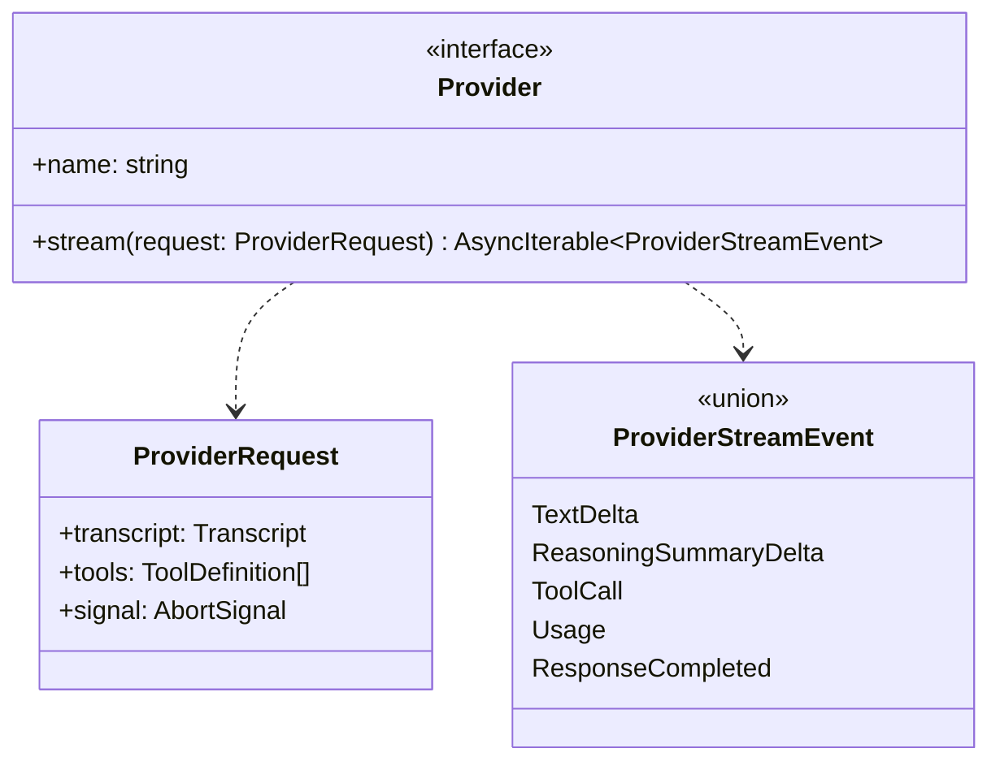
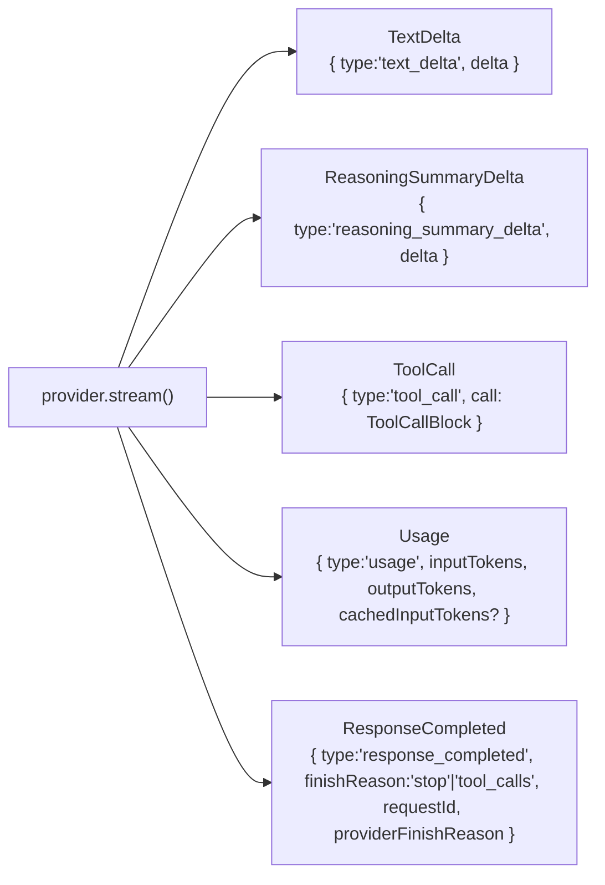
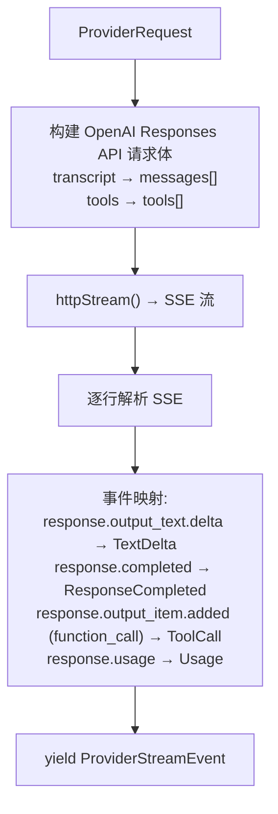
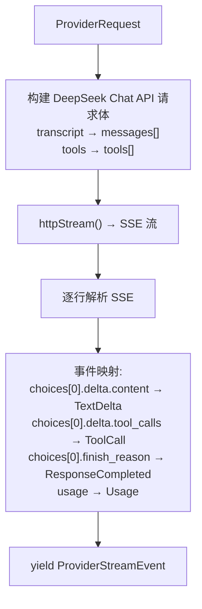
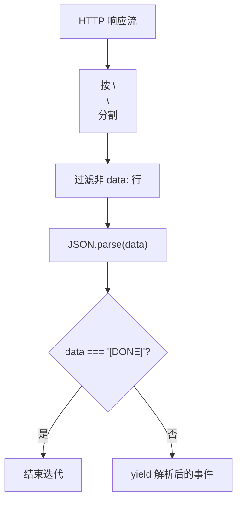

# 第 8 章：Provider 与流式传输

> dugsyn 的 Provider 层统一了 OpenAI Responses API 和 DeepSeek Chat API，通过统一的 `Provider.stream()` 接口向外暴露流事件。

---

## 1. Provider 接口

---

## 2. 五种流事件

| 事件 | 何时 | 含义 |
|------|------|------|
| `text_delta` | 每个 token | 文本增量 |
| `reasoning_summary_delta` | 扩展推理 | 思考过程摘要 |
| `tool_call` | 完整到达 | 一个完整的 tool call |
| `usage` | 流结束 | token 用量统计 |
| `response_completed` | 流结束 | finishReason + requestId |

---

## 3. OpenAI Responses 适配

---

## 4. DeepSeek Chat 适配

---

## 5. SSE 解析

SSE 解析器不假定事件类型 — 由 adapter 层决定如何将 API 事件映射到 `ProviderStreamEvent`。

---

## 6. HTTP 客户端

| 特性 | 说明 |
|------|------|
| 超时 | 连接超时 + 读取超时（可配置） |
| 重试 | 不在此层处理 — 由 Agent loop 的 `ProviderStepError` 处理 |
| 中断 | AbortSignal 传递到底层 fetch |
| 错误 | HTTP 非 2xx → `ProviderError(retryable)` |

---

## 7. Mock Provider

用于测试 — 返回预定义的 `ProviderStreamEvent` 列表，不依赖真实 API。

---

## 8. 文件清单

| 文件 | 说明 |
|------|------|
| `dugsyn/src/providers/provider.ts` | Provider 接口 + ProviderStreamEvent 类型 |
| `dugsyn/src/providers/openai-responses.ts` | OpenAI Responses API 适配器 |
| `dugsyn/src/providers/deepseek-chat.ts` | DeepSeek Chat API 适配器 |
| `dugsyn/src/providers/http.ts` | HTTP 客户端 + 流式请求 |
| `dugsyn/src/providers/sse.ts` | SSE 事件解析器 |
| `dugsyn/src/providers/mock.ts` | Mock Provider（测试用） |
| `dugsyn/src/runtime/agent.ts` | consumeProviderResponse — 事件流消费 |
ENDDOFDOC
echo "Written ch08"