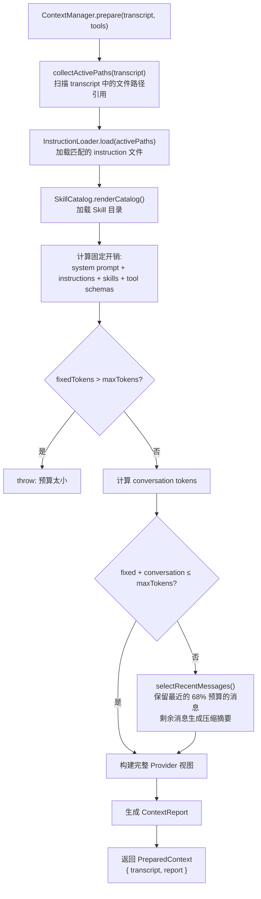
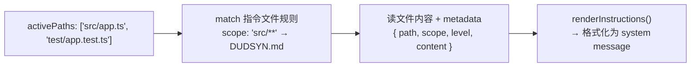
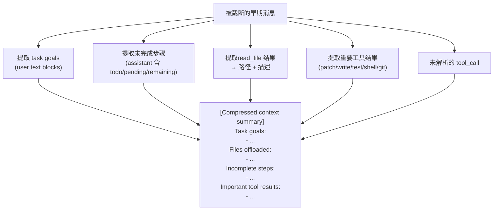
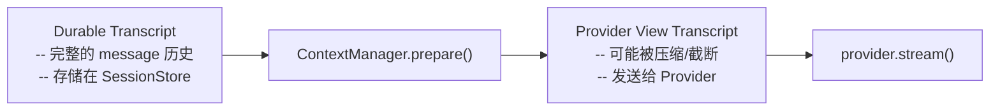

# 第 9 章：上下文管理

> dugsyn 的上下文管理器在每轮 turn 开始前准备 Provider 视图：注入 instruction 文件、加载 Skill 目录、压缩超长对话、生成压缩摘要并归类组件使用情况。

---

## 1. 上下文准备流程



---

## 2. 预算分配

```
maxTokens = --context-tokens || DUGSYN_CONTEXT_TOKENS || config.context.maxTokens || model_default

model_default = resolveModelContextTokens(provider, model)
  deepseek-v4-pro / r1  → 1,000,000
  deepseek-v3 / chat     → 128,000
  openai o1 / o3         → 200,000
  openai gpt-4.1         → 1,000,000
  other openai           → 128,000
  other deepseek         → 128,000
  unknown provider       → 32,000

分配策略:
  ┌───────────────┐
  │ system prompt │  ~固定
  ├───────────────┤
  │ instructions  │  ~按需
  ├───────────────┤
  │ tool schemas  │  ~工具数量
  ├───────────────┤
  │ summary       │  ~压缩后
  ├───────────────┤
  │ conversation  │  ~68% of remaining
  └───────────────┘
```

固定开销（system + instructions + skills + tools）超过预算时直接抛异常，不会降级。

---

## 3. Instruction 加载



Instruction 文件通过 `scope` 字段声明适用范围（glob pattern），只有 active paths 匹配 scope 时才加载。`level` 分为 `project` / `user` / `managed`，不同 level 以不同优先级渲染。

---

## 4. 压缩策略



不是简单截断 — 上下文压缩从被省略的消息中提取语义信息生成结构化摘要：
- **任务目标** — 用户说的关键要求
- **未完成步骤** — 标记了 todo/pending/next 的文本
- **重要工具结果** — 文件操作 / 测试 / git 的结果
- **文件 offload** — 过去轮次 read_file 的结果，标注路径、行数和文件顶部注释描述，模型可随时重读
- **未解析调用** — tool_call 没有对应 tool_result 的

### 4.1 主动文件 offload

除了压缩时 offload，dusyn 还会在每轮主动扫描对话历史：
保留最近 N 轮（默认 2 轮：当前 + 上一轮）的 read_file 结果，更早的替换为轻量标记。

```
[File offloaded. Recover with read_file: src/auth.ts → Authentication middleware [580 lines]]
```

标记包含路径、文件描述（来自顶部注释）和行数，模型需要细节时可精确重读。这个策略不依赖预算 — 即使上下文远未触及 compressAt，旧文件内容也会被主动清理。

可通过 `offloadAfterTurns` 配置调整保留轮数。

---

## 5. Token 估算

```typescript
estimateTokens(value: string): number {
  // 简单启发: UTF-8 字节 ÷ 4
  return Math.ceil(Buffer.byteLength(value, 'utf8') / 4);
}

estimateMessageTokens(item: TranscriptMessage): number {
  // role 6 tokens + content JSON
  return 6 + estimateTokens(role) + estimateTokens(JSON.stringify(content));
}
```

不是精确计数（不载入 tokenizer），用 `bytes / 4` 做保守估算，确保不会超出真正的 token 限制。

---

## 6. ContextReport 结构

```typescript
interface ContextReport {
  maxTokens: number;
  estimatedTokens: number;
  compressed: boolean;
  originalMessages: number;
  includedMessages: number;
  omittedMessages: number;
  activePaths: string[];
  instructionFiles: { path, scope, level }[];
  components: ContextComponentUsage[];
}
```

`components` 详细列出 system / instructions / tool_schemas / summary / conversation 各自的 token 使用。

---

## 7. 与 Transcript 的关系



**Transcript 不变，View 可压缩。** 上下文管理器生成的是 View — 一个可能被压缩的、适合发给 Provider 的新 Transcript。原始 Transcript 保持不变。

---

## 8. 文件清单

| 文件 | 说明 |
|------|------|
| `dugsyn/src/context/manager.ts` | ContextManager — 预算管理 + 压缩 |
| `dugsyn/src/context/instructions.ts` | InstructionLoader — 文件匹配 + 加载 |
| `dugsyn/src/extensions/skills.ts` | Skill 目录渲染 |
ENDDOFDOC
echo "Written ch09"
