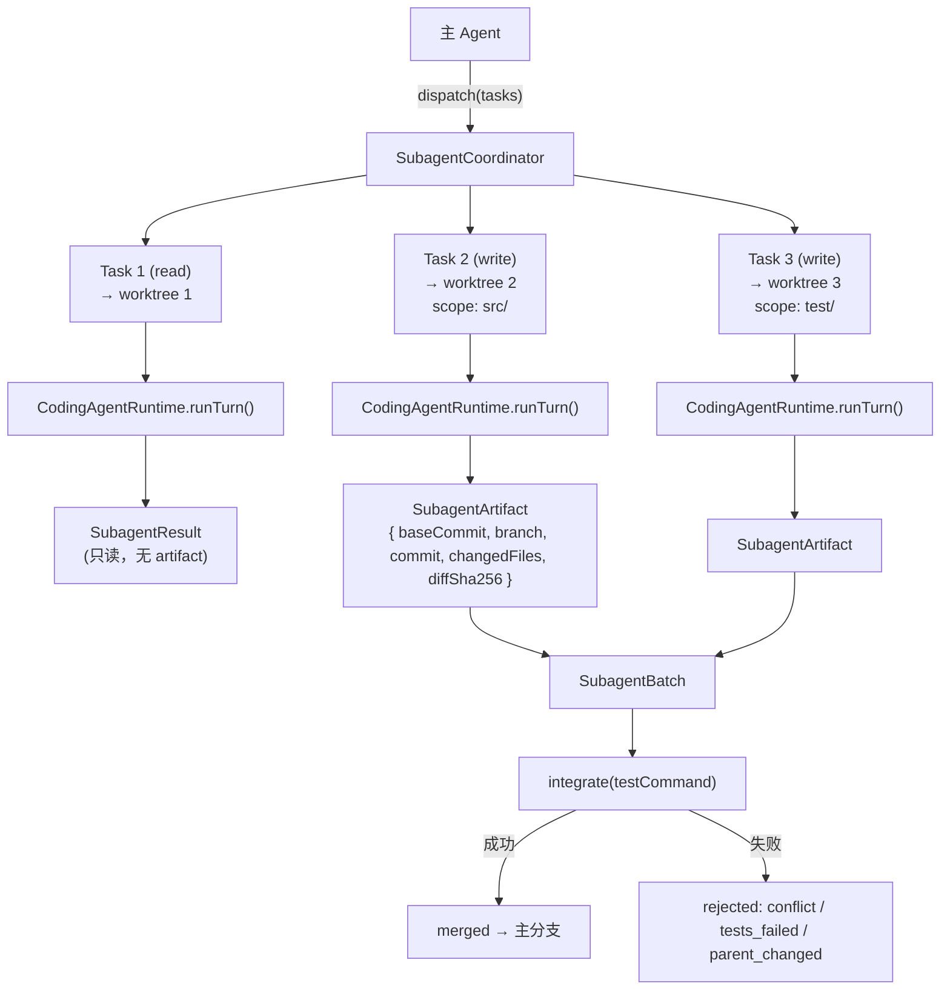
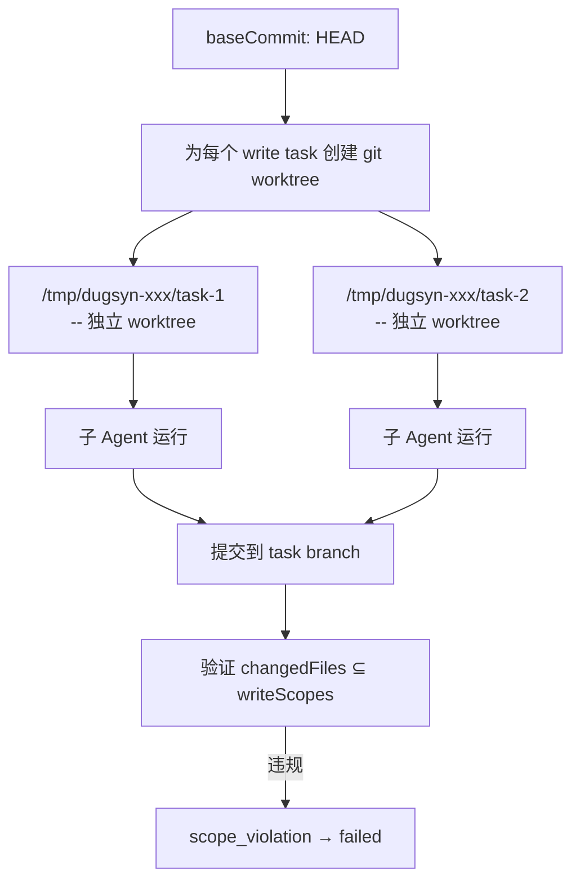
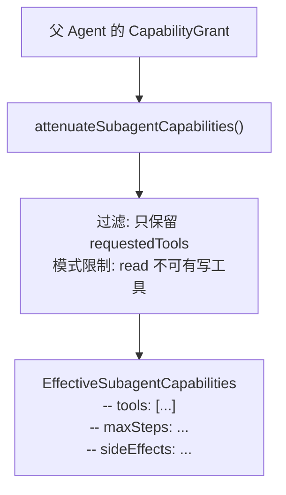
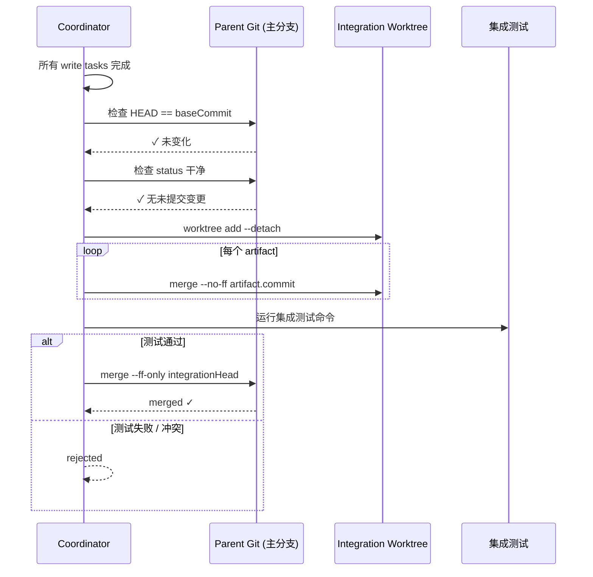
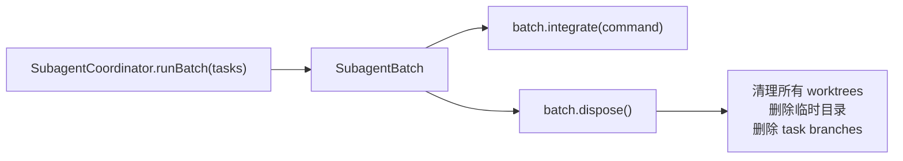

# 第 10 章：子代理系统

> dugsyn 的子代理系统允许并行分派多个隔离任务，每个任务在自己的 Git worktree 中运行，完成后通过 merge 流程集成回主分支。写任务有 scope 限制和提交验证。

---

## 1. 架构总览



---

## 2. 任务类型

```typescript
interface SubagentTask {
  id: string;                    // 唯一标识
  prompt: string;                // 任务指令
  mode: "read" | "write";       // 只读 / 可写
  requestedTools: string[];      // 申请使用的工具
  writeScopes?: string[];        // 写入范围 (write 模式必填)
}
```

| 模式 | writeScopes | artifact | 验证 |
|------|-------------|----------|------|
| `read` | 不需要 | 无 | 无 |
| `write` | 必填，多任务不能重叠 | 有 | 提交文件必须在 scope 内 |

---

## 3. Worktree 隔离



每个 write 任务获得一个独立的 git worktree，在自己的 branch 上提交。完成后：
1. 验证所有变更文件在 `writeScopes` 内
2. 确保不是空提交
3. 生成 `SubagentArtifact` 引用

---

## 4. 能力削弱



子代理的能力是父代理的子集 — 通过 `requestedTools` 白名单和 `mode` 限制衰减。即使父 Agent 有完整权限，子 Agent 也只能用申请的工具。

---

## 5. 集成流程



集成是原子操作：所有子任务都成功后，在一个 integration worktree 中合并所有 branch，运行集成测试，最后 fast-forward 到主分支。

---

## 6. Batch 与 dispose



必须显式调用 `dispose()` 清理 worktree 和临时文件。不调用会导致 `/tmp` 下残留大量 worktree 目录。

---

## 7. 文件清单

| 文件 | 说明 |
|------|------|
| `dugsyn/src/subagents/coordinator.ts` | SubagentCoordinator + SubagentBatch |
| `dugsyn/src/subagents/capabilities.ts` | 能力衰减逻辑 |
| `dugsyn/src/runtime/coding-agent.ts` | CodingAgentRuntime — 子 Agent 运行时 |
| `dugsyn/src/tools/git/adapter.ts` | GitAdapter — 被 coordinator 复用 |
