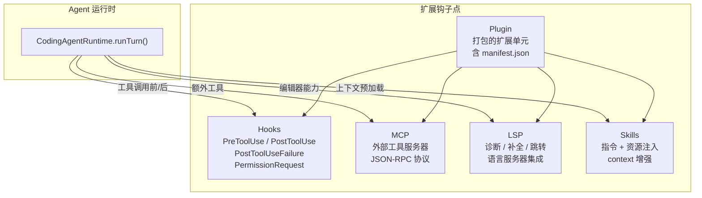
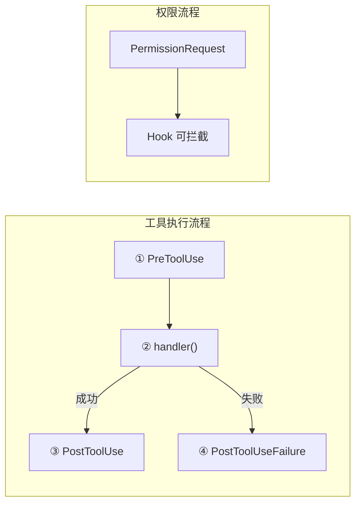
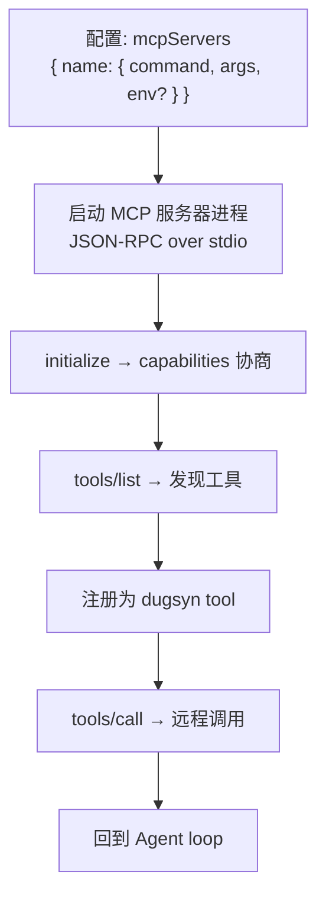
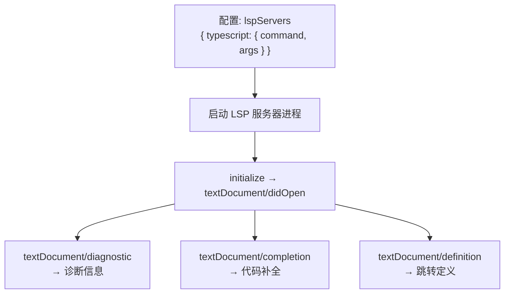
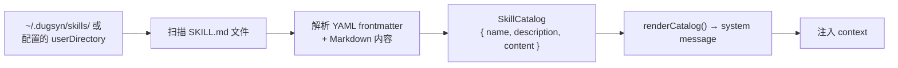
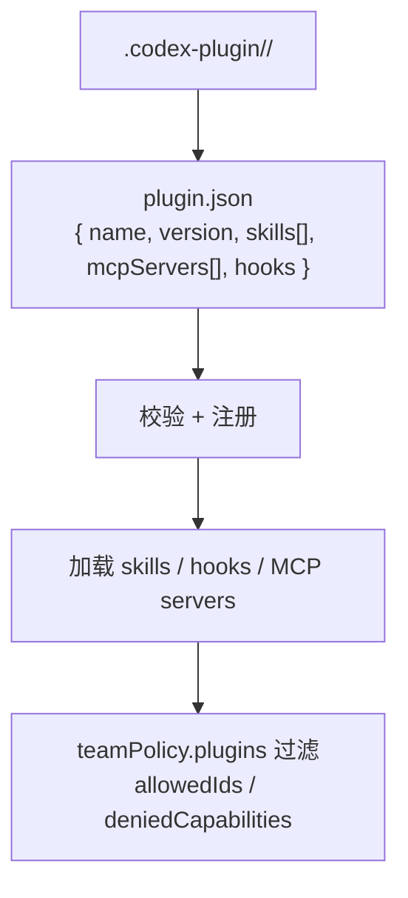
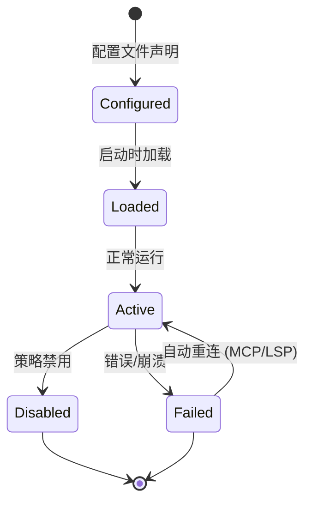

# 第 11 章：扩展系统

> dugsyn 的扩展层提供 5 种可插拔能力：Hooks（生命周期钩子）、MCP（Model Context Protocol）、LSP（Language Server Protocol）、Skills（技能目录）和 Plugin（插件管理）。

---

## 1. 扩展体系



---

## 2. Hooks — 生命周期钩子



| Hook 事件 | 时机 | 可拦截? |
|-----------|------|---------|
| `PreToolUse` | 工具 handler 执行前 | 是（抛 HookBlockedError → permission_denied） |
| `PostToolUse` | 工具成功返回后 | 否（仅通知） |
| `PostToolUseFailure` | 工具失败后 | 否（仅通知） |
| `PermissionRequest` | 权限决策前 | 是（可追加 deny reason） |

配置方式：
```json
{
  "hooks": {
    "PreToolUse": ["node scripts/pre-tool-check.js"],
    "PostToolUse": ["python3 notify.py"]
  }
}
```

---

## 3. MCP — Model Context Protocol



每个 MCP 服务器一个独立子进程，通过 JSON-RPC over stdio 通信。发现的工具自动注册到 ToolRegistry。

---

## 4. LSP — Language Server Protocol



LSP 功能通过工具暴露给 Agent：`lsp_diagnostics`, `lsp_completion`, `lsp_definition`。

---

## 5. Skills — 技能目录



Skills 是纯文本指令文件，在 context 准备阶段加载并注入 system prompt。不涉及代码执行。

---

## 6. Plugin — 打包扩展



Plugin 是打包了 skills + hooks + MCP servers 的扩展单元，受 teamPolicy 控制。组织策略可以限制哪些插件可用、哪些能力被禁用。

---

## 7. 扩展生命周期



MCP 和 LSP 服务器在崩溃后自动尝试重连。Hook 脚本失败不影响工具执行（通知型 hook 静默忽略错误）。

---

## 8. 文件清单

| 文件 | 说明 |
|------|------|
| `dugsyn/src/extensions/hooks.ts` | Hook 系统 — gate / notify 模式 |
| `dugsyn/src/extensions/mcp.ts` | MCP 客户端 — 进程启动 + JSON-RPC |
| `dugsyn/src/extensions/lsp.ts` | LSP 客户端 — 诊断/补全/定义 |
| `dugsyn/src/extensions/skills.ts` | Skill 目录扫描 + 渲染 |
| `dugsyn/src/extensions/plugin.ts` | Plugin 管理 — 加载/校验/策略控制 |
