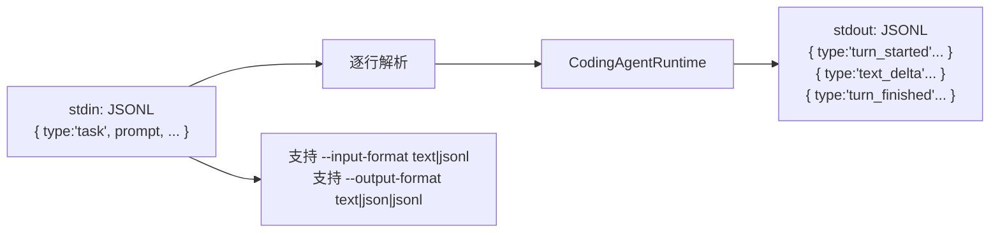
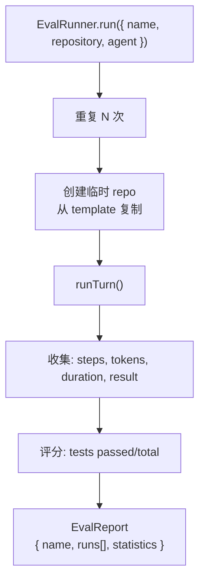
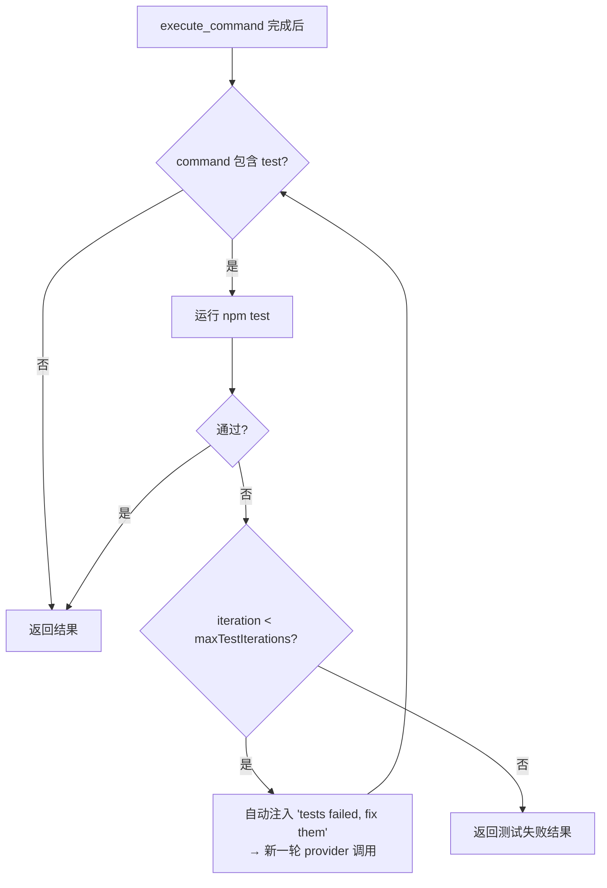
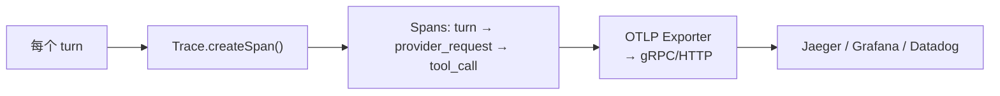
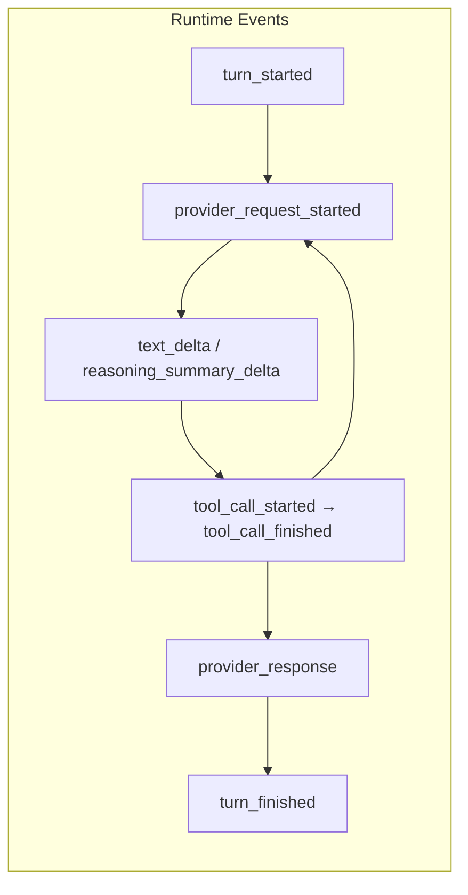

# 第 12 章：高级功能

> 本章覆盖 dugsyn 的几个高级子系统：Headless JSONL 协议、Eval 评估框架、Test Loop 自修复循环和 Observability 可观测性。

---

## 1. Headless JSONL 协议

非交互模式，用于 CI/CD 或批量处理场景。每一行是一个自描述的 JSON 消息：
- 输入：`task` (prompt), `resume` (sessionId)
- 输出：`turn_started`, `text_delta`, `tool_call_started`, `tool_call_finished`, `turn_finished`

---

## 2. Eval 评估框架

EvalRunner 支持：
- **重复运行** — 同一任务跑多次，测量稳定性
- **Git 仓库模板** — 每次 run 从干净副本开始
- **测试评分** — 运行 `npm test` 计算 passed/total
- **Git 变更审计** — 检测工作区是否被意外修改

---

## 3. Test Loop — 自修复循环

test-loop 是自动的：当模型执行 `execute_command` 跑测试且失败时，Agent 自动追加 "fix the failing tests" 指令，不消耗用户的 turn。

---

## 4. Observability — 可观测性

每个 span 记录：
- `startedAt` / `finishedAt`
- `attributes: { provider, model, steps, tokens, error? }`
- 父子嵌套关系

---

## 5. 事件协议

每个 event 携带：
- `protocolVersion` — 协议版本号
- `sequence` — 单调递增序号
- `timestamp` — ISO 8601
- `turnId` — UUID

---

## 6. 文件清单

| 文件 | 说明 |
|------|------|
| `dugsyn/src/cli/headless.ts` | Headless JSONL 模式实现 |
| `dugsyn/src/cli/headless-protocol.ts` | JSONL 消息类型定义 |
| `dugsyn/src/evals/runner.ts` | EvalRunner — 评估框架 |
| `dugsyn/src/runtime/test-loop.ts` | TestLoop — 自动测试修复 |
| `dugsyn/src/runtime/events.ts` | RuntimeEvent 类型定义 |
| `dugsyn/src/runtime/event-schemas.ts` | RuntimeEvent Zod schemas |
| `dugsyn/src/observability/trace.ts` | Trace + Span 实现 |
| `dugsyn/src/observability/exporter.ts` | OTLP exporter |
ENDDOFDOC
echo "Written ch12"